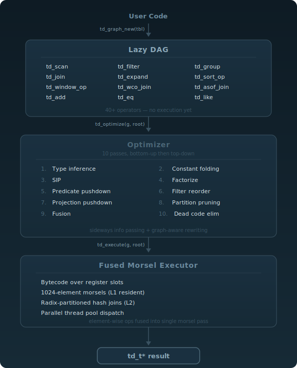
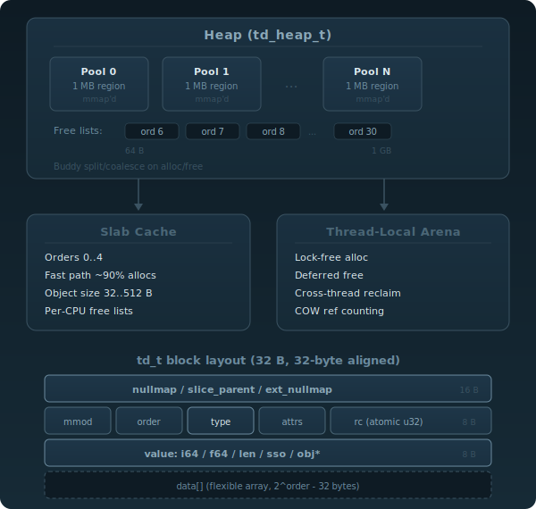

# Teide

Pure C17 zero-dependency columnar dataframe engine with native graph processing.

[](https://github.com/teidedb/teide/actions/workflows/ci.yml)

Lazy fusion API, operation DAG, optimizer, fused morsel-driven execution.
CSR edge indices, graph traversal opcodes, worst-case optimal joins, and
sideways information passing -- all in the same pipeline.

## Why Teide?

| | Teide | DuckDB | Polars |
|-------------------------|-------|--------|--------|
| Language | C17 | C++ | Rust |
| External dependencies | 0 | ~30 | ~200 |
| Public header files | 1 | many | N/A (FFI) |
| Native graph engine | yes | no | no |
| CSR edge storage | yes | no | no |
| Worst-case optimal joins| yes | no | no |
| Factorized execution | yes | no | no |
| SIP optimizer | yes | no | no |
| Custom allocator | buddy + slab | jemalloc | system |
| Morsel-fused pipelines | yes | yes | yes |
| COW ref counting | yes | no | Arc |
| Embeddable (single .h) | yes | no | no |

Teide is not a SQL database. It is an embeddable columnar compute engine
designed for workloads that mix analytics with graph traversal in a single
fused pipeline.

## Features

- **Unified 32-byte block header** -- `td_t` represents atoms, vectors, lists, tables, and selection bitmaps
- **Buddy allocator** with thread-local arenas, slab cache for small objects, COW ref counting
- **Lazy DAG execution** -- build operation graph, optimize, then execute with fused morsel-driven pipelines
- **Morsel-driven parallelism** -- thread pool with 1024-element morsels, radix-partitioned hash tables
- **Graph engine** -- double-indexed CSR (forward + reverse), 1-hop expand, variable-length BFS, shortest path
- **Worst-case optimal joins** -- Leapfrog Triejoin for cyclic patterns (triangles, k-cliques)
- **Factorized execution** -- `td_fvec_t` / `td_ftable_t` avoid materializing cross-products
- **SIP optimizer** -- sideways information passing propagates selection bitmaps backward through expand chains
- **Full optimizer pipeline** -- type inference, constant folding, SIP, factorize, predicate pushdown, filter reorder, fusion, DCE
- **Dictionary-encoded strings** -- adaptive-width symbol columns (8/16/32/64-bit indices)
- **Columnar storage** -- `.col` files, splayed tables, date-partitioned tables, mmap support
- **Window functions** -- ROW_NUMBER, RANK, DENSE_RANK, NTILE, SUM, AVG, MIN, MAX, LAG, LEAD, and more
- **ASOF joins** -- window joins for time-series alignment
- **CSV I/O** -- reader with type inference, configurable delimiter and column types
- **Zero external dependencies** -- pure C17, single public header `include/teide/td.h`

## Architecture

<picture>
  
</picture>

## Memory Model

<picture>
  
</picture>

## Build

```bash
# Debug (ASan + UBSan)
cmake -B build -DCMAKE_BUILD_TYPE=Debug
cmake --build build

# Release (optimized)
cmake -B build_release -DCMAKE_BUILD_TYPE=Release
cmake --build build_release

# Run all tests (270+ tests across 28 suites)
cd build && ctest --output-on-failure

# Run a single test suite
./build/test_teide --suite /vec

# Run benchmarks
./build/bench_queries
```

## Quick Start

### Analytics: filter + group + sum

```c
#include <teide/td.h>

int main(void) {
    td_heap_init();
    td_sym_init();

    /* Build a table with 3 columns */
    td_t* tbl = td_read_csv("trades.csv");

    /* Construct the operation DAG */
    td_graph_t* g = td_graph_new(tbl);

    td_op_t* flag   = td_scan(g, "flag");
    td_op_t* zero   = td_const_i64(g, 0);
    td_op_t* pred   = td_eq(g, flag, zero);       /* flag == 0 */

    td_op_t* region = td_scan(g, "region");
    td_op_t* amount = td_scan(g, "amount");
    td_op_t* flt_r  = td_filter(g, region, pred);  /* apply filter */
    td_op_t* flt_a  = td_filter(g, amount, pred);

    td_op_t* keys[]    = { flt_r };
    uint16_t agg_ops[] = { OP_SUM };
    td_op_t* agg_ins[] = { flt_a };
    td_op_t* grp = td_group(g, keys, 1, agg_ops, agg_ins, 1);

    /* Optimize and execute */
    td_op_t* root   = td_optimize(g, grp);
    td_t*    result = td_execute(g, root);

    /* Cleanup */
    if (result && !TD_IS_ERR(result)) td_release(result);
    td_graph_free(g);
    td_release(tbl);
    td_sym_destroy();
    td_heap_destroy();
    return 0;
}
```

### Graph traversal: CSR + variable-length expand

```c
#include <teide/td.h>

int main(void) {
    td_heap_init();
    td_sym_init();

    /* Build edge table: src -> dst */
    td_t* src_v = td_vec_from_raw(TD_I64, (int64_t[]){0,0,1,2}, 4);
    td_t* dst_v = td_vec_from_raw(TD_I64, (int64_t[]){1,2,3,3}, 4);

    int64_t s_src = td_sym_intern("src", 3);
    int64_t s_dst = td_sym_intern("dst", 3);

    td_t* edges = td_table_new(2);
    edges = td_table_add_col(edges, s_src, src_v);
    edges = td_table_add_col(edges, s_dst, dst_v);
    td_release(src_v);
    td_release(dst_v);

    /* Build double-indexed CSR (forward + reverse) */
    td_rel_t* rel = td_rel_from_edges(edges, "src", "dst", 4, 4, true);

    /* Start nodes: just node 0 */
    td_t* start = td_vec_from_raw(TD_I64, (int64_t[]){0}, 1);

    int64_t s_id = td_sym_intern("id", 2);
    td_t* node_tbl = td_table_new(1);
    node_tbl = td_table_add_col(node_tbl, s_id, start);
    td_release(start);

    /* BFS: 1..3 hops forward, track path */
    td_graph_t* g = td_graph_new(node_tbl);
    td_op_t* nodes = td_scan(g, "id");
    td_op_t* reach = td_var_expand(g, nodes, rel, 0, 1, 3, true);

    td_op_t* root   = td_optimize(g, reach);
    td_t*    result = td_execute(g, root);

    if (result && !TD_IS_ERR(result)) td_release(result);
    td_graph_free(g);
    td_rel_free(rel);
    td_release(edges);
    td_release(node_tbl);
    td_sym_destroy();
    td_heap_destroy();
    return 0;
}
```

### Join two tables

```c
#include <teide/td.h>

int main(void) {
    td_heap_init();
    td_sym_init();

    /* Orders table */
    td_t* orders = td_read_csv("orders.csv");
    /* Customers table */
    td_t* custs  = td_read_csv("customers.csv");

    td_graph_t* g = td_graph_new(orders);
    td_op_t* lo = td_const_table(g, orders);
    td_op_t* ro = td_const_table(g, custs);

    td_op_t* lk   = td_scan(g, "cid");
    td_op_t* lk_arr[] = { lk };
    td_op_t* rk_arr[] = { lk };

    /* Inner join on cid (join_type: 0=inner, 1=left, 2=full) */
    td_op_t* joined = td_join(g, lo, lk_arr, ro, rk_arr, 1, 0);

    td_op_t* root   = td_optimize(g, joined);
    td_t*    result = td_execute(g, root);

    if (result && !TD_IS_ERR(result)) td_release(result);
    td_graph_free(g);
    td_release(orders);
    td_release(custs);
    td_sym_destroy();
    td_heap_destroy();
    return 0;
}
```

## API Overview

Single public header: [`include/teide/td.h`](include/teide/td.h)

| Category | Functions |
|-------------------|-------------------------------------------------------------------------|
| **Lifecycle** | `td_heap_init`, `td_heap_destroy`, `td_sym_init`, `td_sym_destroy` |
| **Memory** | `td_alloc`, `td_free`, `td_retain`, `td_release`, `td_cow` |
| **Atoms** | `td_bool`, `td_i64`, `td_f64`, `td_str`, `td_sym`, `td_date`, ... |
| **Vectors** | `td_vec_new`, `td_vec_append`, `td_vec_set`, `td_vec_get`, `td_vec_slice`, `td_vec_concat`, `td_vec_from_raw` |
| **Tables** | `td_table_new`, `td_table_add_col`, `td_table_get_col`, `td_table_ncols`, `td_table_nrows` |
| **DAG sources** | `td_graph_new`, `td_scan`, `td_const_i64`, `td_const_f64`, `td_const_str`, `td_const_table` |
| **Unary ops** | `td_neg`, `td_abs`, `td_not`, `td_sqrt_op`, `td_log_op`, `td_isnull`, `td_cast`, `td_upper`, `td_lower`, `td_trim_op` |
| **Binary ops** | `td_add`, `td_sub`, `td_mul`, `td_div`, `td_mod`, `td_eq`, `td_ne`, `td_lt`, `td_le`, `td_gt`, `td_ge`, `td_and`, `td_or`, `td_like` |
| **Aggregations** | `td_sum`, `td_count`, `td_avg`, `td_min_op`, `td_max_op`, `td_first`, `td_last`, `td_stddev`, `td_count_distinct` |
| **Structural** | `td_filter`, `td_sort_op`, `td_group`, `td_distinct`, `td_join`, `td_asof_join`, `td_select`, `td_head`, `td_tail` |
| **Window** | `td_window_op` (ROW_NUMBER, RANK, DENSE_RANK, NTILE, SUM, AVG, LAG, LEAD, ...) |
| **Graph** | `td_expand`, `td_var_expand`, `td_shortest_path`, `td_wco_join` |
| **CSR / Relations**| `td_rel_build`, `td_rel_from_edges`, `td_rel_save`, `td_rel_load`, `td_rel_mmap`, `td_rel_free` |
| **Optimizer** | `td_optimize`, `td_fuse_pass` |
| **Executor** | `td_execute` |
| **Storage** | `td_col_save`, `td_col_load`, `td_col_mmap`, `td_splay_save`, `td_splay_load`, `td_part_load` |
| **CSV** | `td_read_csv`, `td_read_csv_opts`, `td_write_csv` |
| **Parallelism** | `td_pool_init`, `td_pool_destroy`, `td_parallel_begin`, `td_parallel_end` |

## Performance

Benchmark harness: [`bench/bench_queries.c`](bench/bench_queries.c)

| Query | 10K rows | 1M rows | 1M throughput |
|---------------------------|----------|---------|---------------|
| Q1: filter + group + sum | 1.3 ms | 19 ms | 52M rows/sec |
| Q2: join + count | 0.7 ms | 19 ms | 52M rows/sec |

Apple M2 Pro, single-threaded. Run your own:

```bash
cmake -B build_bench -DCMAKE_BUILD_TYPE=Release -DTEIDE_BENCH=ON
cmake --build build_bench
./build_bench/bench_queries
```

Key design choices that affect performance:

- **Morsel-fused execution**: element-wise ops are fused into a single pass over 1024-element chunks, maximizing L1 cache residency
- **Radix-partitioned hash joins**: adaptive radix bits (2..14) size partitions to fit in L2 cache
- **Buddy allocator**: O(1) alloc/free for common sizes via slab cache; no system allocator overhead
- **COW ref counting**: zero-copy slices and shared columns; copy only on mutation
- **Selection bitmaps**: `TD_SEL` segments skip entire morsels when all rows pass or all are filtered

## Project Structure

```
include/teide/td.h         Single public header (all types, opcodes, API)
src/mem/                    Buddy allocator, slab cache, VM abstraction
src/core/                   Type system, atoms, strings, symbols
src/vec/                    Vector operations, morsel iterator
src/table/                  Table construction, column access, schema
src/store/                  Column files, splayed tables, partitions, CSR
src/ops/                    DAG construction, optimizer, executor, LFTJ
src/io/                     CSV reader/writer
test/                       270+ tests across 28 suites
bench/                      Benchmark harness
```

## License

[MIT](LICENSE)
